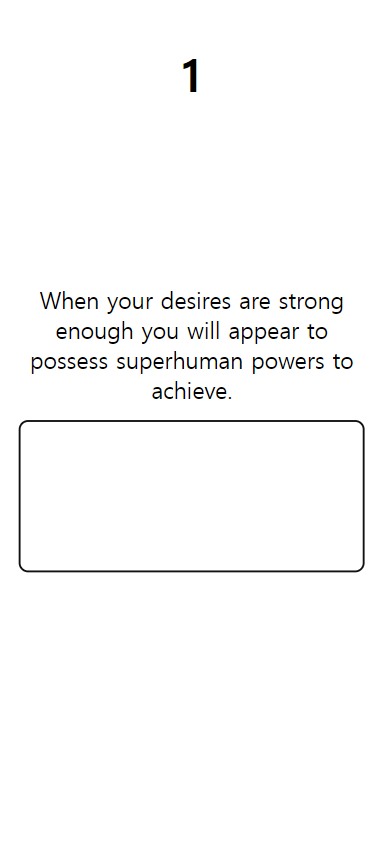

# Infinite Typing

Typing game application with infinitely generated quotes.
 
Please take a moment to try this web application [here](https://infinite-typing.vercel.app/).

## How to Use

Follow typing the quote displayed above the textarea. Correct characters will be displayed green; incorrect characters will be displayed red with underline.

Type in as fast as you can. The timer is shown on the top of the page.

## Skills

- Typescript
- Node JS
- CSS
- Html

## Display Examples

### Desktop Display

### Galaxy S20 Ultra Display (412 x 915)

## Acknowledgement

This web application is developed using Vite environment.
 
This web application is deployed on [vercel](https://infinite-typing.vercel.app/).
 
The copyright of [Favicon](https://fonts.google.com/icons?selected=Material+Symbols+Outlined:keyboard:FILL@0;wght@400;GRAD@0;opsz@24&icon.query=keyboard&icon.platform=web) used in this web application belongs to Google.

## Contact Info

- Name: Yeseong Kim
- Personal Email: mryesung1@gmail.com
- Public Email: yeseonk@uci.edu
- Phone: (+1) 949-836-1299

## Takeaways

- Refined understanding of the critical role of maintaining type-safety through leveraging TypeScript functionalities to optimize coding practices.
- Engineered a refined timer functionality, meticulously evaluating the variance between the current and initial dates to guarantee precise updates and functionality.
